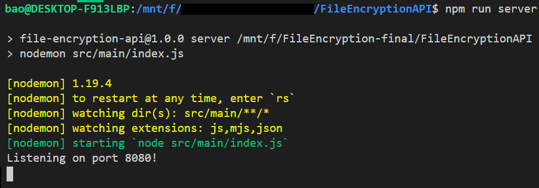

# FileEncryptionAPI

<p align="center"> 
Test update|2|3|File Encryption API, as the name suggested, can be used to encrypt and decrypt files for storage.
This API is built as a custom connector to Microsoft Power Automate.
File Encryption API allows file-based encryption of all types of files available.
    <br> 
</p>

## 📝 Table of Contents

- [baodinh 13 mar test 2](#about)
- [Getting Started](#getting_started)
- [Deployment](#deployment)
- [Usage](#usage)
- [Built Using](#built_using)
- [TODO](../TODO.md)
- [Contributing](../CONTRIBUTING.md)
- [Authors](#authors)
- [Acknowledgments](#acknowledgement)

## 🧐 About <a name = "about"></a>

File Encryption API is built as a custom connector to Microsoft Power Automate that allows 
Flow users to encrypt and decrypt their files stored on Microsoft OneDrive/SharePoint.

## 🏁 Getting Started <a name = "getting_started"></a>

These instructions will get you a copy of the project up and running on your local machine for development and testing purposes.

### Prerequisites

This File Encryption API uses NodeJS. `node` and `npm` is required.
Guides on download and installing Node.js and `npm` can be found [here](https://docs.npmjs.com/downloading-and-installing-node-js-and-npm).

Make sure that `node` and `npm` is installed by running the following commands:
```
node -v
npm -v
```

### Installing

```
npm install
```

## 🔧 Running the tests <a name = "tests"></a>

```
npm run test
```

If everything is well, you should see all 12 test cases passed.


`server` contains integration tests. `utils` contains unit tests.

### And coding style tests

The project uses `eslint` but it is not yet strictly enforced.

## 🎈🚀 Usage and Deployment <a name="usage"></a>

To run the server for development and/or deployment, use
```
npm run server
```

`npm run server` will run `nodemon src/main/index.js`. 

`nodemon` facilitates live reloading of the server each time the server source code is changed.

The server will be running on port `8080` by default.




## ⛏️ Built Using <a name = "built_using"></a>

- [NodeJS](https://nodejs.org/en/) - Server Environment
- [Express](https://expressjs.com/) - Server Framework

## 🎉 Acknowledgements <a name = "acknowledgement"></a>

-  for the initial boilerplate code
